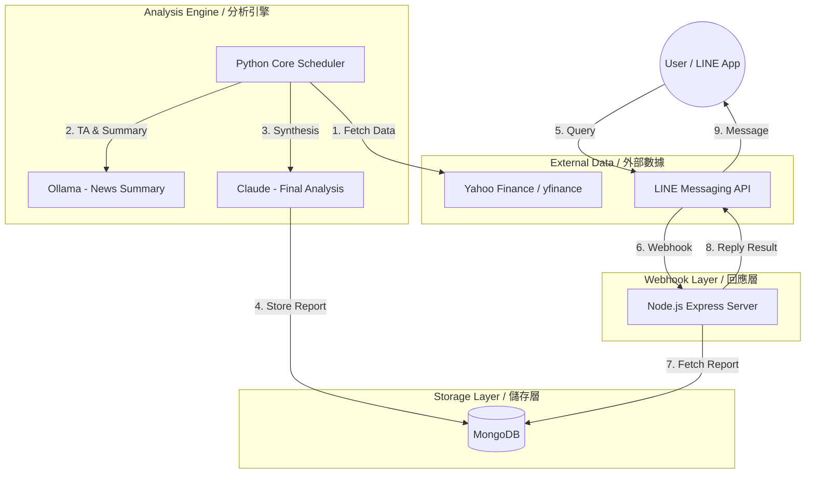

# 📈 Stock Analysis LINE Bot MVP
AI-Driven Market Insights & Automated Technical Analysis | AI 股市分析與自動化技術型態監測

Stock Bot MVP is a dual-core system designed to **automate technical market research** and **financial news aggregation**. It empowers investors by providing instant, AI-synthesized insights via LINE, significantly **reducing the time spent on manual chart analysis and news filtering**.

Stock Bot MVP 是一個雙核心系統，旨在 **自動化技術型態研究** 與 **財經新聞彙整**。透過 LINE 提供即時的 AI 綜合洞察，顯著 **節省投資者在手動看盤與篩選新聞上花費的時間**。

---

# 🎬 DEMO 影片示範
### [點此觀看 Demo 影片 / Watch Demo on YouTube](https://www.youtube.com/shorts/qzjCtCFEAyE)

---

## 🏗 System Architecture (系統架構)

---

## ✨ Key Features (主要功能)

### 📊 Automated Technical Analysis (自動化技術分析)
- **EN**: Scans 60-day historical data for 8+ technical patterns (MA, RSI, etc.).
- **ZH**: 自動掃描 60 日歷史數據，分析包含均線、RSI 在內的 8 種以上技術型態。

### 📰 AI News Synthesis (AI 新聞彙整)
- **EN**: Aggregates filtered financial news, summarized by local **Ollama** and synthesized by **Claude**.
- **ZH**: 彙整財經新聞，透過本地 **Ollama** 進行第一層去噪摘要，再由 **Claude** 生成精簡投資導讀。

### 📱 Instant Mobile Insights (手遊式即時監測)
- **EN**: Access professional-grade stock reports instantly via LINE Official Account.
- **ZH**: 透過 LINE 官方帳號，隨時隨地獲取專業級的個股分析報告與市場焦點。

### 🛡 Hybrid Intelligence (混合智慧)
- **EN**: Combines the privacy of **Ollama** with the high-level reasoning of **Claude**.
- **ZH**: 結合 **Ollama** 的資料隱私性與 **Claude** 的高階邏輯推理。

---

## 🌟 Use Cases & Example Results (使用情境與回覆示例)

- **Scenario: Morning Market Brief / 情境：早盤晨報**: 
  - 💬 *Action*: User types "**今日重點**" (Today's Focus).
  - 🤖 *Bot*: "Today's Market: **Bullish Sentiment**. Watch **NVDA** (High Volatility) and **TSLA** (MA Cross-up)."
  - 🤖 *答*: 「今日盤勢：**情緒偏多**。重點關注：**NVDA** (高波動)、**台積電** (均線金叉向上)。」

- **Scenario: Instant Stock Check / 情境：個股查詢**: 
  - 💬 *Action*: User types "**2330**" or "**TSMC**".
  - 🤖 *Bot*: "**TSMC (2330)**: Technical pattern shows a **Cup with Handle** forming. RSI: 62 (Healthy)."
  - 🤖 *答*: 「**台積電 (2330)**：技術型態顯示 **杯柄型 (Cup with Handle)** 正在形成。RSI: 62 (健康)。」

---

## 🛠 Project Structure & Setup (專案結構與設定)

### 1️⃣ Part 1: Node.js Webhook (`line_bot_skill`)
Handles LINE messages and retrieves reports from MongoDB. / 處理 LINE 訊息並從 MongoDB 提取報告。
- **Setup**: `npm install`
- **Configure**: Set `LINE_CHANNEL_ACCESS_TOKEN` & `MONGO_URI` in `.env`.

### 2️⃣ Part 2: Python Analysis (`python-analysis`)
The brain that scrapes, calculates, and analyzes. / 負責抓取、運算與分析的核心。
- **Setup**: `pip install -r requirements.txt`
- **Run**: `python main.py` (Daily scheduled execution / 每日排程執行).

---

## 🎬 Credits
- ⚠️ This project is **~95% generated** using AI (Claude 3.5 Sonnet & GPT-4o).

---
© 2026 Stock Analysis Bot Open Source Project.